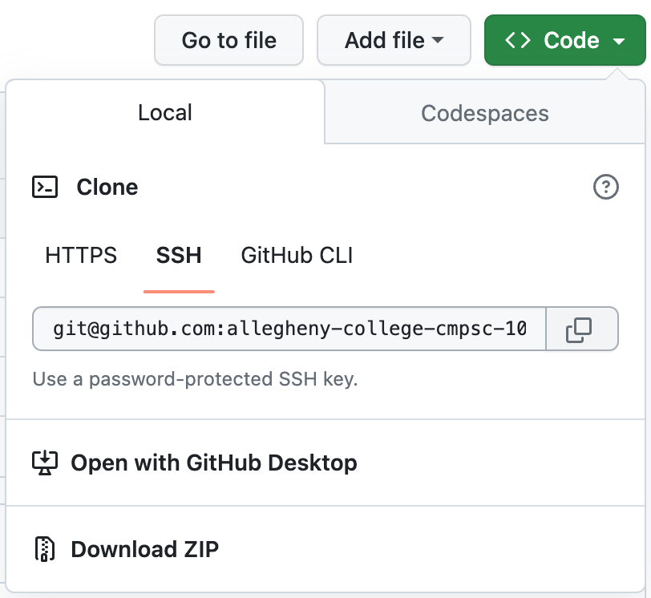

# VPython Sandbox

This is an ungraded repo that allows you to mess around with Vpython locally just to try things out. 

# To clone this repo...

1. Click 'Use as Template' to make your own copy of this repo. 
2. Open you `CMPSC-100` folder in VSCode.
3. Copy the clone link for this repo by clicking the \<Code\> dropdown just above the list of files, then choose SSH and hit the double-square copy icon. Open the Terminal in VSCode with Terminal>New Terminal then enter `git clone <text you just copied>`. When repo finishes cloning, `cd` into the new directory. 

    

4. You can do whatever you want in this repo! It is yours for experimentation. 
